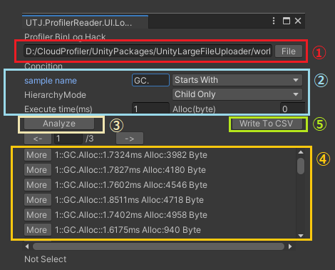
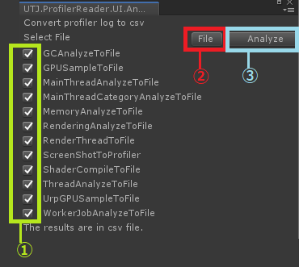

# ProfilerReader
プロファイラーのログファイルを解析するツールです 
Read this in other languages: [English](README.md), 日本語 

## 概要
このツールを "Unity Profiler".
For example, generate csv files that shows Samples allocating many Managed Heap from "Unity Profiler" binary log.

## 対応バージョン
2019.4 / 2020.3/2021.1/2021.2/2021.3/2022.2/2022.3
 2022.1 skip

## Filter検索機能
「Tools->UTJ->ProfilerReader->AnalyzeToCsv」で下記ウィンドウが出ます。 

 
1.プロファイラーのログを指定します 
2.見つけたいサンプルの条件を指定します 
3.条件に合うサンプルを見つけます 
4.条件に合ったサンプルの結果を表示します 
5.結果をCSVに書き出します。 

 

## CSV化機能
### GUI操作について
「Tools->UTJ->ProfilerReader->AnalyzeToCsv」で下記ウィンドウが出ます。 

 
このWindowではCSV化されたサマリーを生成します。 
1.書き出しを行う種別の指定を行います。 
2.Profilerのログファイルを指定します。 
3.解析を実行します 

### CUI操作でのサンプル
Unity.exe -batchMode -projectPath "ProjectPath" -logFile .\Editor.log -executeMethod UTJ.ProfilerReader.CUIInterface.ProfilerToCsv -PH.inputFile "Binary logFile(.data/.raw)" -PH.timeout 2400 -PH.log

バイナリログファイルと同じ場所にサブフォルダを作成し、そちらにCSVファイルが生成されます。

## CSV Files:
CSファイルは、元のファイル名にフッターを付けたファイル名で出力します。 
下記のような形でCSVはいくつか書き出します 

■「xxx_mainThread_frame.csv」 
フレーム毎のメインスレッドでのカテゴリ別のCPU処理負荷のリスト
 
■「xxx_gc_result.csv」 
全体を通したGCメモリ確保個所のリスト
 
■「xxx_gpu_sample.csv」 
ProfilerのGPU項目をフレーム毎にカテゴリ別に出されるリスト
 
■「xxx_main_self.csv」 
全体を通してサンプル別のCPU負荷リスト
 
■「xxx_memory.csv」 
ProfilerのMemory項目をフレーム毎に出したリスト
 
■「xxx_rendering.csv」 
ProfilerのRendering項目をフレーム毎に出したリスト
 
■「xxx_renderthread.csv」 
RenderThreadの状況をフレーム毎に出したリスト
 
■「xxx_result.csv」 
フレーム毎のThreadの状況リスト
 
■「xxx_shader_compile.csv」 
Shaderコンパイルが走った状況を書き出すリスト
 
■「xxx_urp_gpu_sample.csv」 
GPU項目をUniversal RP向けに書き出したリスト
 
■「xxx_worker.csv」 
WorkerThreadの状況を書き出したリスト
 

